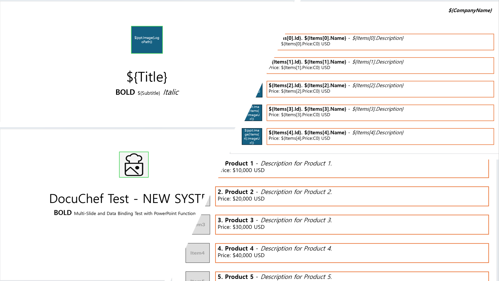

# DocuChef
The Master Chef for Document Templates - Cook delicious documents with your data and templates.



## Overview
DocuChef provides a unified interface for document generation across multiple formats. It supports Excel document generation using ClosedXML.Report.XLCustom and PowerPoint document generation using DollarSignEngine, with future plans to integrate additional template engines for Word documents.

In the spirit of its culinary name, DocuChef offers both standard API methods and fun cooking-themed extension methods that make template processing feel like preparing a delicious dish!

## Current Features
- **Excel Template Processing**: Generate Excel documents from templates using ClosedXML.Report.XLCustom
- **PowerPoint Template Processing**: Generate PowerPoint presentations from templates with embedded variables and functions
- **Flexible Variable Binding**: Add variables, complex objects, collections to your templates
- **Global Variables**: Access system information and date/time within your templates
- **Custom Function Support**: Register custom functions for Excel cell processing and PowerPoint shape processing
- **Error Handling**: Clear error reporting with specialized exception types
- **Culinary API Theme**: Optional cooking-themed extension methods for a more enjoyable API experience
- **Consistent Document Interface**: All document types implement the `IDish` interface for unified handling

## Planned Features
- Word document support
- Additional built-in functions for Excel and PowerPoint templates
- Enhanced PowerPoint chart and table functionality
- Enhanced formatting options

## Installation
```
Install-Package DocuChef
```
Or via .NET CLI:
```
dotnet add package DocuChef
```

## Quick Start

### Standard API Usage
```csharp
// Create document processor
var chef = new Chef();

// Load your template (Excel or PowerPoint)
var recipe = chef.LoadTemplate("template.xlsx"); // or "template.pptx"

// Add your data
recipe.AddVariable("Title", "Sales Report");
recipe.AddVariable("Products", productList);
recipe.AddVariable("Date", DateTime.Now);

// Generate and save the document
recipe.Cook("result.xlsx"); // or "result.pptx"
```

### Culinary-themed API
```csharp
// Create document processor
var chef = new Chef();

// Load your recipe (template)
var recipe = chef.LoadRecipe("template.xlsx"); // or "template.pptx"

// Add ingredients (variables)
recipe.AddIngredient("Title", "Sales Report");
recipe.AddIngredients(productData); // Add all properties from an object

// Cook the document and serve it
var dish = recipe.CookDish();
dish.Serve("result.xlsx"); // or "result.pptx"

// Optionally, present the dish to the user
dish.Present(); // Opens in default application
```

### One-step Document Generation
```csharp
// Create document processor
var chef = new Chef();

// Prepare a dish directly from a template and data
chef.PrepareDish("template.xlsx", salesData, "result.xlsx");
```

## Working with Excel Templates

### Excel-specific Features
```csharp
// Load Excel template
var recipe = chef.LoadTemplate("template.xlsx");

// Register custom functions for Excel processing
recipe.RegisterFunction("FormatCurrency", (cell, value, parameters) => {
    if (value is decimal amount)
    {
        cell.Style.NumberFormat.Format = "$#,##0.00";
        return amount;
    }
    return value;
});

// Or using the culinary API
recipe.RegisterTechnique("FormatCurrency", (cell, value, parameters) => {
    // Same implementation
});

recipe.Cook("result.xlsx");
```

## Working with PowerPoint Templates

### PowerPoint Features
```csharp
// Load PowerPoint template
var recipe = chef.LoadTemplate("template.pptx");

var categories = new List<Category>();
recipe.AddVariable("Categories", categories);
// recipe.AddVariable(data);

// Generate the presentation
recipe.Cook("result.pptx");
```